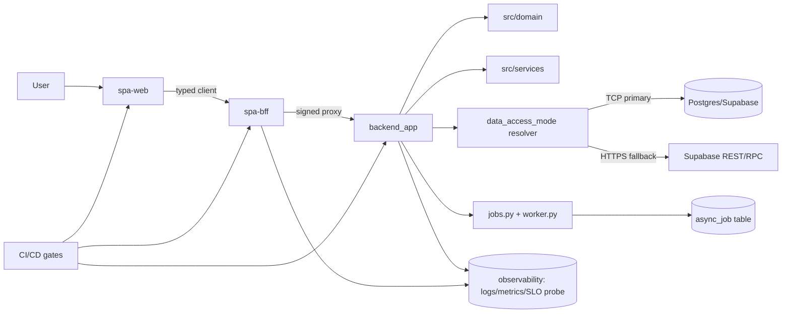

# Enterprise Hardening Plan (Large-Scale First Design)  
## Single Document: 12-week roadmap + reference architecture + gap matrix  

Date: 2026-08-26 (Asia/Tehran)  
Scope: Current OKR platform codebase after the transport/contracts reliability sprint and BFF policy-generation work.

This document answers: **“If I were building this from scratch for enterprise scale, what would I do differently?”**  
It combines:
1. A **12-week implementation roadmap**  
2. A **greenfield reference architecture (text/spec + Mermaid-ready diagram)**  
3. A **current-to-target gap matrix** for planning and execution

---

## 0) Current state baseline (what is already improved)

Already implemented/verified (verified against code and drills 2026-08-26):
- OpenAPI codegen + drift gate — export script, CI drift gate, generated `schema.d.ts`, and generated-type adoption for the initial read paths
- Signing key rotation with key-ID + overlap window + runbook + tests (fully verified)
- Formal SLO definitions and probe coverage for all five SLOs (fully verified)
- Async dead-letter observability and retry endpoint (endpoints, healthz count, allowlist, tests — fully verified)
- BFF route policy generated from explicit metadata validated against OpenAPI, with CI drift coverage (fully verified)
- Data transport resilience (semaphore + circuit breaker + lifecycle controls — fully verified)
- TCP-primary/HTTPS-fallback read resolver with fail-closed mutations (fully verified)
- Migration blocker hardening and compose smoke reliability (role-existence guards verified)

P0 completion status:
- The sprint loose ends and verification drills are closed in `docs/architecture-status.md`.
- The next active stage is **Weeks 3–6: Data access strategy hardening**.

Interpretation: this is no longer a “new project with only ideas”—it is now an enterprise-grade platform in an alpha-to-production transition state.

---

## 1) Reference architecture if rebuilt from scratch for enterprise scale

### 1.1. Strategic architecture principles

1. **Contract-first runtime boundary**
   - OpenAPI/JSON contract is source-of-truth.
   - Client/server stubs and allowlist are generated artifacts, not hand-maintained lists.
2. **Layer purity**
   - Domain logic and invariants live outside transport/adapters.
   - All I/O happens through explicit ports/adapters.
3. **Deterministic startup + observability**
   - No hidden import-time side effects.
   - Every service starts through explicit bootstrap phases.
4. **Resilience by design**
   - Idempotency, bounded retries, and circuit-breaking are standard for all outbound calls.
5. **Multi-tenant-safe defaults**
   - Tenant context is mandatory in request, policy, and data filters.
6. **Operational first-class**
   - SLOs, alert thresholds, runbooks, and failure-drills are designed as product features.

### 1.2. Greenfield component map (ideal target)

- **UI layer**: `spa-web` (Next.js)  
  - Feature shells + shared component library + query cache store  
  - Uses generated API client only
- **Edge/API Gateway layer**: `spa-bff` (Node/TS)  
  - Authentication/session enrichment  
   - Route policy enforcement from explicit metadata validated against the OpenAPI contract  
  - Request signing/verification orchestration  
  - Contract-based proxy generation (target)
- **Core application layer**: `backend_app` (FastAPI)  
  - Transport orchestration + orchestration endpoints  
  - Validation + authorization checks
- **Domain layer**: `src/domain`  
  - Business rules for OKR/goals/check-ins/tasks/workspaces
- **Application services**: `src/services`  
  - Use-cases (create, update, close cycle, snapshot, scoring)
- **Infrastructure adapters**: `src/infrastructure/*`  
  - DB, external services, queue worker, file store
- **Async processing plane**: `jobs + worker`  
  - Deterministic job state machine with dead-letter APIs
- **Operations plane**: `observability + deploy + migration tooling`
  - Metrics, tracing, health, migration checks, runbooks

### 1.3. Mermaid architecture (copy into Markdown renderer that supports Mermaid)

### 1.4. If rebuilt cleanly, concrete design differences from current

1. Generated allowlist and route policy are derived from contract metadata validated against the OpenAPI contract, not hand-maintained route literals.
2. Data access strategy uses injected interfaces, not globals.
3. Frontend architecture is feature-domain-first, with each domain owning its state and selectors.
4. Job subsystem has dedicated DLQ/retry/admin API from day one.
5. Security/rotation/replay safeguards are packaged as platform primitives with periodic drill tests.
6. All startup/shutdown lifecycle hooks are explicit and tested.

---

## 2) Implementation roadmap (from current state to large-scale platform)

> **Re-scoped 2026-08-26**: original plan assumed 2–3 engineers + SRE + security.
> Actual context is a single developer on a personal-PC deployment, so phases are
> sequenced solo and sized in focused work sessions. Multi-tenant work is moved to
> a clearly-marked greenfield section (zero tenant code exists today — it is not
> hardening). The UI feature-shell refactor phase was **cut**: the frontend is
> already decomposed (~75 files under `atlas-shell/`); the original plan
> contradicted its own gap matrix here.

Assumptions:
- Team size: 1 developer (phases parallelizable only with more people)
- Baseline: current code plus P0 hardening already in place
- Goal: prepare for predictable scale and enterprise operations

### Legend
- **P0**: must complete to reduce production risk
- **P1**: important reliability/performance improvements
- **P2**: strategic foundation for long-term scale

---

### Phase 0 (completed 2026-08-26): finish sprint loose ends — P0
1. **Goal**: close the gaps the reliability sprint left open before starting new work.
2. **Work**:
   - Implement and verify SLO probe measurements for SLO-2–5.
   - Adopt generated types for the initial `/v1/read/query` payload paths.
   - Run the live verification drills and move completed backlog items to CLOSED.
3. **Deliverables**: probe covers all 5 SLOs; generated types are used by app
   code; ledger items are CLOSED with drill evidence.
4. **Acceptance**: all five SLO measurements and the required verification
   drills completed successfully.
5. **Status**: CLOSED. Evidence is recorded in `docs/architecture-status.md`.

### Weeks 1–2 (completed 2026-08-26): Contract + policy spine stabilization — P0
1. **Goal**: remove drift risk across web-BFF-backend boundary entirely.
2. **Work**:
    - Generate BFF allowlist/policy mapping from explicit route metadata validated
       against the committed OpenAPI contract.
   - Add contract lint for forbidden method/path combinations.
3. **Deliverables**:
   - Generated allowlist checked into repo with generation script.
   - CI gates: schema drift, client drift, route-policy mismatch.
4. **Acceptance**:
   - PR cannot merge if BFF contract does not align with backend routes.
5. **Status**: CLOSED. The generated policy, stale check, CI gate, and unchanged
   BFF auth matrix passed; intentionally excluded internal routes remain excluded.

### Weeks 3–6 (next active stage): Data access strategy hardening (explicit adapter + metrics) — P1
1. **Goal**: make read-path strategy explicit, injectable, and transparent before
   taking on broader enterprise operations work.
2. **Work**:
   - Introduce `IDataAccessStrategy` + injectable implementations.
   - Replace global mode checks with request metadata decisions.
   - Emit per-request strategy metrics and fallback reasons.
3. **Deliverables**:
   - No module-level mutable mode for runtime routing.
   - Dashboard with fallback counts and latency by strategy.
4. **Acceptance**:
   - Operators can prove why any request used one mode or the other.
5. **Risk**: behavior drift under outage; mitigate by shadow mode simulation tests.
6. **First implementation slice**:
    - Inventory the current resolver entry points and mutable mode state.
    - Define the smallest `IDataAccessStrategy` protocol around the existing
       read operations.
    - Add request-scoped strategy and fallback-reason telemetry before migrating
       all callers.

### Weeks 7–9: Enterprise-grade async reliability and operations — P1
1. **Goal**: complete queue reliability as product-level capability.
2. **Work**:
   - Expand dead-letter APIs: filter by reason, actor, service, age.
   - Add retry safety guardrails (max total retry window + max operator retry per minute).
   - Add structured eventing for job lifecycle transitions.
3. **Deliverables**:
   - Self-service job recovery workflow (list, inspect, retry, suppress).
   - Daily job-health report in telemetry.
4. **Acceptance**:
   - Zero critical jobs require SQL-only recovery for a one-week simulation window.
5. **Risk**: retry storms; mitigate via bounded global token bucket + alert.

### Weeks 10–12: Reliability governance + pre-production readiness — P1
1. **Goal**: encode enterprise operational rigor into process and automation.
2. **Work**:
   - Add migration policy checks and rollback drills.
   - Add chaos/fault drills and synthetic health probes in CI schedule.
   - Formalize ADRs for boundary changes and incident ownership playbooks.
3. **Deliverables**:
- Runbook for recovery modes and blast-radius decisioning.
   - Pre-production readiness gate with evidence links.
4. **Acceptance**:
   - Full drill runbook passes without emergency intervention.
5. **Risk**: process overhead; mitigate by automating evidence capture.

### Deferred: multi-tenant foundation — P2 (greenfield, not hardening)
Zero tenant code exists today (no `tenant_id` anywhere in schema or middleware).
This is new architecture, not reliability hardening, and is deferred until there
is an actual multi-tenant requirement:
- Tenant context middleware in BFF and backend.
- Tenant-aware policy guards for data and route access.
- Audit fields on all domain writes (`tenant_id`, `actor_id`, `request_id`, `trace_id`).
- Security policy test suite for cross-tenant access denial.

### Post-roadmap maturity targets
- Monthly key rotation without downtime
- SLO-based release criteria
- Dedicated platform owner for contract health and policy compliance
- Cross-team boundaries that survive independent deployment

---

## 3) Current vs target enterprise-gap matrix

### 3.1. Why this matrix exists
This bridges “what exists now” and “what enterprise scale demands,” using root-cause lens:
- **Gap cause**: what creates risk now
- **Current mitigation**: what already exists
- **Target**: what to build for scale
- **Transition actions**: concrete next steps

| Area | Current (post-sprint) | Enterprise gap cause | Target | Transition actions |
|---|---|---|---|---|
| API contract governance | OpenAPI codegen + drift gate; generated BFF route policy with explicit metadata and drift gate | Full cross-layer policy derivation and generated clients for every external contract are still future maturity work | Fully generated allowlist + policy matrix + generated clients for all external contracts | Expand generation scope and add forbidden-policy tests |
| Auth/session/security | Signed transport + rotation mechanism + tests | Key lifecycle and trust boundary still partially operationalized for every environment pattern | Centralized secret management integration + rotation telemetry + mTLS internal lanes | Add vault/secret store abstraction and rotate drill in CI |
| Data access model | Fallback resolver implemented with globals and tested behavior | Global mutable strategy makes reasoning/recovery harder in multi-instance context | Explicit strategy DI + observability + failover decision logs | **Next:** introduce strategy interfaces and per-request reason fields |
| Domain architecture | Domain/service split exists and improved | Some compatibility scaffolding still coupled to legacy calling paths | Clean domain application layer with explicit use-case APIs and deprecation plan | Gate new features through service boundaries; sunset compatibility aliases |
| Frontend structure | Strongly decomposed component set in practice | Feature ownership and state boundaries still mixed in practice for some flows | Feature-sliced architecture with owned state stores and contract tests | Continue component split with route-to-feature module mapping |
| Async jobs | DLQ visibility + retry endpoint implemented | Queue policy and blast radius controls need stronger ops guardrails | Full job management UI/API with reason-aware filtering and retry quotas | Add reason taxonomy and operator controls |
| Observability | SLO definitions + probe script implemented | SLO enforcement and synthetic checks still partially manual | Automatic threshold checks, alerts, and incident escalation automation | Add scheduler-driven checks with fail/notify bindings |
| Deployment/Migrations | Migration blocker fixed, compose smoke stable | Policy layer for migrations and readiness still lightweight | Multi-stage deployment gates with rollback proofs and migration compatibility matrix | Add migration dependency graph checks + migration smoke matrix |
| Readiness/health | `/healthz` exists and useful signals available | No granular subsystem readiness gates at each layer | Multi-domain readiness contract and progressive boot checks | Add startup dependency gates by subsystem |
| Testing strategy | >500 tests across API/UI/security paths | Scaling tests to parallel and chaos coverage is still growing | Contract fuzzing + chaos + perf regression suite in CI/CD | Add automated fault-injection and load baseline |

### 3.2. Priority mapping by severity

- **Current priority**: data-access strategy DI, request-level fallback reasons, and strategy telemetry.
- **Completed P0**: SLO probe coverage, generated-type adoption, policy-driven BFF allowlist generation, and the recorded reliability drills.
- **High strategic**: async reliability controls + secret lifecycle integration + deployment/migration policy hardening.
- **Medium strategic**: data-access DI refactor (works and is tested today; single-instance deployment lowers urgency) and advanced chaos automation.
- **Deferred**: multi-tenant guardrails (greenfield; no requirement exists yet).

---

## 4) Recommended operating model (how this is executed)

### Solo-developer reality
All roles collapse to one person wearing sequential hats. The practical model:
- **One phase at a time** — no parallel workstreams.
- Each phase ends with committed evidence (tests + doc updates) before the next begins.
- If help arrives, the first split is: contract/policy spine vs async/jobs reliability.

### Cadence
1. Weekly planning: choose 2–3 P0/P1 items only.
2. Mid-week checkpoint: contract and regression health.
3. End-week evidence: tests + dashboards + rollback proof.

### Exit criteria for transition to enterprise release readiness
- P0 gates pass continuously for 2 consecutive release cycles.
- One full key-rotation drill completed and documented.
- One full dead-job recovery workflow run without direct DB access.
- SLO probe script scheduled and alerting integrated.
- No critical unresolved route-contract drift incidents.

---

## 5) If you want this in next step

If you approve this document, I will generate a companion:
- `enterprise_backlog_execution_sheet.md` with **each roadmap item split into tickets** (epic/story/task), owners, dependencies, and optional story points.
