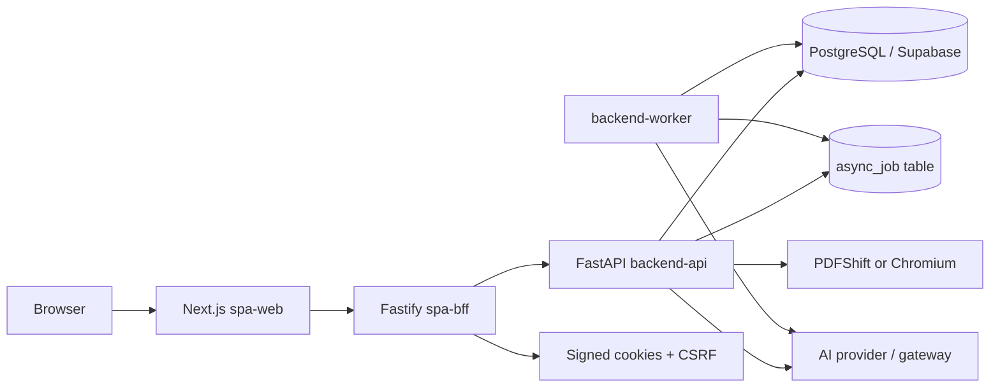

# Production Readiness Audit
Documentation HQ: [README](../README.md)

Date: 2026-07-27

This audit treats the repository as an inherited system that must be operated, modified, and scaled without relying on prototype-era context.

## Executive Summary

The application is an OKR and strategy-execution workspace that separates strategic change work from BAU operational work. It includes a Next.js SPA, a Fastify BFF, a FastAPI backend API, a backend worker, SQLModel/PostgreSQL persistence, Alembic migrations, and optional AI/PDF integrations.

Readiness classification: **production risky, but recoverable through incremental hardening**. The repository has moved beyond a throwaway prototype: it has migrations, tests, deployment assets, auth/RBAC concepts, background jobs, observability primitives, and documented topology. It is not yet comfortably scalable because key ownership and operational boundaries remain too concentrated in large modules, runtime behavior depends on many environment flags, the SPA/BFF/backend split increases release complexity, and the database model carries broad business logic coupling.

Production readiness score: **3.0 / 5**.

| Area | Score | Rationale |
| --- | ---: | --- |
| Architecture | 3.0 | Clear service topology exists, but backend and domain boundaries remain partially coupled. |
| Security | 3.2 | Strong intent around BFF boundary, service tokens, request signing, password policy, and RLS migration; needs external verification and secret management maturity. |
| Reliability | 2.8 | Durable jobs and health endpoints exist; graceful shutdown, rollback playbooks, SLOs, and failure-mode tests are incomplete. |
| Maintainability | 2.7 | Tests are extensive, but several giant modules and duplicated proxy/direct modes create change risk. |
| Scalability | 2.6 | PostgreSQL-centric design can scale to moderate load; horizontal behavior depends on DB/Redis-backed state and careful pooler configuration. |
| Operations | 2.8 | Docker/Kubernetes assets and deploy checks exist; observability, runbooks, dashboards, and admin process ergonomics need work. |

## Phase 1 — Application Archaeology

### Product Understanding

Problem solved: the product provides a strategy cockpit for OKRs, forcing measurable outcome evidence and keeping BAU work out of strategic reporting.

Users:

- Members who own tasks, check in on key results, and use timers.
- Managers who review team scope, assign/coach OKRs, and run weekly governance.
- Admin/operators who manage users, teams, cycles, deployment, and system health.
- Transformation or leadership users who inspect rollups, risks, alignments, and learning-loop outputs.

Critical user journeys:

1. Login through the BFF and establish a browser session.
2. Select a cycle and navigate Atlas.
3. Create or update goals, objectives, key results, and tasks.
4. Start/stop a focus-task timer and record work logs.
5. Submit check-ins that update KR progress and evidence.
6. Review leadership metrics, stale check-ins, deadline health, and audit summaries.
7. Run AI analysis or PDF weekly reporting through durable backend jobs.
8. Administer teams, users, roles, passwords, and active cycles.

Core business workflows:

- Strategic hierarchy management: Cycle -> Goal -> Objective -> Key Result -> Task.
- Evidence and scoring: KR metric movement, objective/goal rollups, confidence and risk.
- Governance loop: weekly plans, retrospectives, experiments, outcomes, and audits.
- Alignment loop: objective-to-objective and objective-to-goal/KR links with cycle protection.
- Operational boundary: BAU work is explicitly kept outside the app.

Mission-critical areas:

- Authentication/session validity and token-version revocation.
- Authorization for mutation and read scope.
- Database integrity and migrations.
- Timer/work-log correctness.
- Check-in and KR progress mutation correctness.
- Async job idempotency/rate limiting.
- Audit logs for security-sensitive and governance actions.

### Application Overview

The primary runtime is a SPA-first web application. Browser traffic reaches `spa-web`, authenticated browser API calls pass through `spa-bff`, and service-authenticated requests reach `backend-api`. Heavy work is executed by `backend-worker` using durable `async_job` records. Persistence is PostgreSQL/Supabase with SQLModel models and Alembic migrations.

### Core Features

- OKR hierarchy CRUD and lifecycle states.
- User/team/cycle administration.
- Role-aware reads and mutations.
- Timer and work-log tracking.
- Check-ins, weekly planning, retrospectives, experiments, and outcomes.
- Alignment graph and cross-hierarchy links.
- AI analysis and PDF generation.
- Audit event persistence and summarized audit queries.
- Deployment checks for backend-private topology and production config.

### Critical Paths

- Login/session/me: BFF cookie session, CSRF token, backend validation.
- Mutation path: SPA -> BFF allowlist -> FastAPI route -> authorization -> SQLModel session -> commit.
- Read path: SPA -> BFF -> backend read query -> SQLModel/Supabase API mode -> serialized view.
- Job path: submit -> rate/idempotency checks -> `async_job` -> worker claim/execute -> poll result.
- Timer path: start/stop with ownership gating and unique open work-log constraint.

### Unknown Areas

- Actual production hosting platform and secret manager are not represented as code.
- Backup/restore schedule, RPO/RTO, and disaster-recovery drills are not explicit.
- SLOs, alert thresholds, dashboards, and on-call runbooks are not defined.
- Real data volume, tenant count, traffic shape, and AI/PDF usage patterns are unknown.
- Accessibility, browser support, and internationalization acceptance criteria are not audited here.

### Risk Areas

- Large modules (`backend_app/main.py`, `src/services/supabase_api_mode.py`, `src/crud.py`) concentrate behavior and increase regression risk.
- Multiple data access modes (direct PostgreSQL and Supabase REST fallback) can diverge.
- Runtime configuration is powerful but high-dimensional; bad combinations can pass local testing.
- Operational reliability relies heavily on database semantics; Redis/database-backed shared state must be mandatory for horizontal production.
- AI/PDF integrations create data-egress, latency, cost, and failure-mode risks.

## Phase 2 — Architecture Review

### Current Architecture Diagram

### Frontend Architecture

Current state: Next.js SPA with local test setup and BFF-mediated API calls. The architecture intentionally keeps service secrets out of the browser and routes mutations through backend APIs.

Concerns:

- State ownership is partly documented but must remain enforced through component boundaries and regression tests.
- The frontend package has a single visible test file at shallow depth; critical UX journeys need broader component and E2E coverage.
- Dependency versions use caret ranges despite a lockfile, which is acceptable for application installs but should be treated carefully in CI.

### Backend Architecture

Current state: FastAPI backend API plus worker. Routes are partially modularized under `backend_app/routers`, while many handler implementations and imports still aggregate in `backend_app/main.py`. Shared business logic lives under `src/` with `crud.py` as a facade and domain modules for authorization, analytics, scoring, lifecycle, reads, and progress.

Concerns:

- `backend_app/main.py` remains a large orchestration hotspot.
- CRUD/domain/service layering is real but incomplete; some integration code still knows too much about persistence and fallback behavior.
- Supabase REST fallback paths can create a second implementation of business behavior.

### API Design

Current state: Versioned `/v1` backend API, BFF allowlisting, service token auth, optional request signing, idempotency support for jobs, and token-version session validation.

Concerns:

- API contracts should be generated or documented from schemas, not inferred from tests and handlers.
- Error responses need a consistent public error envelope and stable error codes across BFF/backend.
- Compatibility policy for `/v1` changes is not documented.

### Database Design

Current state: SQLModel models, Alembic migrations, FKs/check constraints/indexes, async jobs, audit events, auth throttle state, alignment entities, teams/users/roles, lifecycle states.

Concerns:

- SQLModel metadata reset in `models.py` is an import-time smell that may mask module lifecycle problems.
- JSON payload/result fields in `async_job` are flexible but limit queryability and validation.
- Some uniqueness/index behavior is dialect-specific and must be continuously tested against PostgreSQL, not only SQLite.

### Authentication and Authorization

Current state: password hashes, roles, managers, teams, BFF session cookies, CSRF, token-version invalidation, backend service access, request signing, and authorization domain modules.

Concerns:

- Need production-grade password reset/invite flow, audit review, and explicit lockout operations.
- Need external penetration testing around BFF allowlist, forwarded IP handling, CSRF, and direct backend exposure.

### External Integrations

- AI providers are policy-gated by env flags and provider configuration.
- PDF generation supports PDFShift and Chromium.
- Supabase PostgreSQL and optional Supabase REST API mode are core platform dependencies.

### Background Jobs

Current state: durable `async_job`, backend worker, rate limits, pending limits, idempotency key, pruning settings, and worker observability tests.

Risk: job execution lacks a visible dead-letter queue, operator retry UI, and per-kind resource budgets beyond rate limiting.

### File / Storage Handling

Current state: backup import/export and PDF/HTML export exist. No large object store abstraction is evident.

Risk: backup uploads are allowed through the BFF with a 50 MB body limit; production needs explicit storage, retention, encryption, and malware/content handling policies if this grows.

### Caching Strategy

Current state: runtime cache helpers exist for Atlas snapshots and app-cycle caching; database remains source of truth.

Risk: cache invalidation and cross-process behavior must be documented and tested under multiple workers.

### State Management

Current state: BFF owns browser session cookies/CSRF; backend security state can use memory, database, or Redis; app state should be database/Redis in production.

Risk: memory-backed state is unsafe for horizontal production and must be blocked in production deploys.

### Error Handling

Current state: backend and BFF log exceptions and return generic messages in several paths. Observability context and audit logging exist.

Risk: inconsistent error envelope and missing correlation ID propagation to client-facing errors slow incident response.

### Strengths

- Service boundaries are explicit and avoid exposing backend service tokens to the browser.
- Migrations and tests show deliberate hardening work.
- Durable job records provide a better foundation than in-process background tasks.
- Security controls include service tokens, signing, CSRF, token-version revocation, rate limiting, and deployment checks.

### Weaknesses

- Large modules still hide behavior and make ownership unclear.
- Runtime modes and fallbacks multiply test matrix size.
- Operational docs are deployment-heavy but not incident/runbook-heavy.
- API contracts and data contracts are not first-class generated artifacts.

### Architectural Risks

- Divergence between direct DB mode and Supabase API mode.
- Production-only failures from environment combinations not covered by tests.
- Scaling blockers from DB-backed coordination if indexes/pruning are insufficient.
- Security regressions from expanding allowlists or mutation routes without generated policy checks.

### Recommended Future Architecture

Keep the current modular monolith plus BFF and worker. Do not introduce microservices. Move toward:

- Thin FastAPI route modules with handlers delegated to domain/application services.
- One authoritative data access path per business capability; remove or strictly quarantine fallback duplicates.
- Generated OpenAPI + client contract tests between BFF and backend.
- Mandatory distributed security state for production.
- Explicit operational layer: runbooks, dashboards, alerts, migration playbooks, backup restore drills.

## Phase 3 — Twelve-Factor Application Audit

| Factor | Score | Current state and evidence | Risk | Recommended fix | Effort |
| --- | ---: | --- | --- | --- | --- |
| 1. Codebase | 3 | One repo contains SPA, BFF, backend, worker, migrations, deploy assets, docs, and tests. Some Windows launcher scripts and backlog/docs add noise. | Medium | Add ownership map enforcement, archive obsolete scripts, keep `CODEBASE_MAP.md` current, add repo navigation section for new maintainers. | S |
| 2. Dependencies | 3 | Python dependencies are pinned; Node has lockfiles but package manifests use semver ranges. | Medium | Add Dependabot/Renovate, vulnerability scanning, license checks, and unused dependency audits. | S-M |
| 3. Configuration | 3 | Config is env-driven with validation for backend/BFF production settings. | Medium | Centralize config reference into generated schema; fail startup on unknown dangerous combinations; require secrets from a manager in production. | M |
| 4. Backing Services | 3 | PostgreSQL/Supabase, Redis option, AI, PDF, and external API modes are configurable. | Medium | Define abstraction boundaries and production support tiers for each backing service; add service health checks and timeout budgets. | M |
| 5. Build / Release / Run | 2 | Docker/Kubernetes assets exist; migrations exist; rollback/release promotion is not fully codified. | High | Add CI pipeline, immutable image tags, migration preflight, release manifest, and rollback runbook. | M |
| 6. Processes | 3 | App is mostly stateless if sessions/security state are shared; jobs are durable. | Medium | Block memory state in production; add worker concurrency and idempotency runbooks. | S-M |
| 7. Port Binding | 4 | FastAPI, Fastify, and Next.js are independently runnable services with health endpoints. | Low | Document exact ports, private/public ingress, and readiness semantics per service. | S |
| 8. Concurrency | 2 | Horizontal scale is plausible but depends on DB/Redis state and careful row locking. | High | Add load tests, multi-worker tests, queue-depth alerts, and DB pooler validation in CI. | M-L |
| 9. Disposability | 2 | Startup validation exists; graceful shutdown and recovery drills are not obvious. | Medium | Add SIGTERM handling verification, readiness/liveness probes, worker lease expiry tests, and startup timing budgets. | M |
| 10. Dev/Prod Parity | 2 | Docker Compose and K8s manifests exist; local SQLite/test modes can diverge from PostgreSQL behavior. | Medium | Add PostgreSQL-backed integration profile in CI and local compose; document parity exceptions. | M |
| 11. Logging | 3 | Structured backend logging, audit events, and metrics snapshot exist. | Medium | Standardize JSON logs across BFF/backend/worker; add tracing, dashboards, and alerts. | M |
| 12. Admin Processes | 2 | Alembic and scripts exist; operational one-off workflows are not packaged. | Medium | Add CLI admin commands for user recovery, job retry/cancel, audit export, backup restore test, and data fixes. | M |

## Phase 4 — Code Quality Audit

### Critical

- No critical code-quality defect was proven from static inspection alone; critical findings require runtime/security validation.

### High

- `backend_app/main.py` is still too large and import-heavy, which increases conflict and regression risk.
- `src/services/supabase_api_mode.py` duplicates substantial behavior and can drift from direct DB behavior.
- `src/crud.py` remains a broad facade that can become a dumping ground for unrelated business rules.
- API error handling is not visibly normalized across all routes.

### Medium

- SQLModel metadata reset at import time is fragile and should be isolated to test/runtime bootstrap if still needed.
- Configuration is spread across Python, TypeScript, deploy scripts, and docs.
- Test suite is broad but frontend and browser journeys are comparatively thin.
- Some deployment scripts are platform-specific `.bat` files that should not be primary operational automation.

### Low

- Documentation is abundant but can become stale because architecture, backlog, deployment, and guides overlap.
- Naming mixes product concepts (`Atlas`) and generic backend/service names; this is manageable but needs a glossary in code ownership docs.

## Phase 5 — Security Audit

Authentication:

- Password hashes and password rotation fields exist.
- BFF signs session cookies and issues CSRF cookies.
- Backend validates current user and token versions.
- Auth throttle state exists.

Authorization:

- Roles include admin, manager, member.
- Authorization domain modules and mutation authorization matrix tests exist.
- Risk remains around read-scope consistency and future route additions.

Data security:

- Runtime DSN policy discourages superuser and direct non-pooler Supabase connections when strict mode is enabled.
- Secrets are env-driven and examples use placeholders.
- Production must use a real secret manager and rotation process.

Application security:

- BFF allowlisting and backend-private deploy checks reduce exposed surface.
- Request signing and service tokens reduce direct backend abuse.
- Body size limit exists in BFF, but backup import/export needs a stricter operational policy.
- Dependency vulnerability scanning must be automated.

Security recommendations:

1. Make distributed security state mandatory in production.
2. Add OpenAPI route inventory to compare mutation routes, allowlist entries, auth requirements, and tests.
3. Add dependency/security scans to CI.
4. Run PostgreSQL RLS and authorization tests against a real PostgreSQL database.
5. Add a documented incident process for credential compromise, token rotation, and session invalidation.

## Phase 6 — Database Review

Schema design:

- Core hierarchy and support tables are present.
- Migrations include lifecycle, alignment, performance indexes, integrity constraints, RLS, async jobs, audit events, teams, ownership, and token version.

Indexing:

- Models define indexes for users, async jobs, audit events, throttle state, and common ownership fields.
- Need query-plan validation under production-like data.

Migrations:

- Alembic is present and migration history is non-trivial.
- Need zero-downtime migration discipline: expand/migrate/contract, backfill batching, lock-time budgets.

Query performance:

- Dedicated analytics/read query modules exist.
- Risk remains in hierarchical traversals, leadership rollups, stale check-in scans, and audit summaries as data grows.

Data integrity:

- FK/check constraints and lifecycle validations exist.
- Need periodic integrity audits and production constraint drift checks.

Transaction handling:

- SQLModel sessions and commits are used broadly.
- Need explicit transaction boundaries per command and idempotency guarantees for retried mutations.

Potential Scaling Problems:

- Leadership metrics and Atlas snapshots may become expensive with 10x data.
- `async_job` and `audit_event` tables need partitioning or aggressive retention if traffic increases.
- Database-backed rate/security state can become hot without Redis or careful indexing.

Data Risks:

- Backup import/export can damage data if not isolated behind admin-only controls and restore drills.
- JSON job payloads/results may store sensitive prompts or user content without clear retention classification.
- Supabase API fallback can bypass assumptions made in direct SQL paths if not kept equivalent.

Recommended Improvements:

- Add PostgreSQL integration tests for migrations, constraints, and query plans.
- Add table-size, index-bloat, slow-query, and lock monitoring.
- Define retention for audit events, jobs, backups, and AI/PDF artifacts.
- Add migration review checklist and rollback plan per release.

## Phase 7 — Testing Audit

Current coverage:

- Unit/integration tests: substantial Python backend/domain coverage.
- BFF tests: present for server/config/proxy/session behavior.
- E2E tests: at least one Playwright SPA login-to-Atlas test exists.
- Regression tests: many bug-specific tests exist for security, timer, backend config, date handling, and performance hot paths.

Critical paths without enough tests:

- Full browser happy path across create/update/check-in/timer/AI job/PDF.
- Real PostgreSQL migration and RLS behavior.
- Multi-worker concurrency and job claim contention.
- Production deployment validation in an environment close to the real host.
- Failure-mode tests for AI/PDF provider timeouts and partial outages.

Testing Recovery Plan:

Week 1:

- Add a smoke test script that starts SPA+BFF+backend+worker using Docker Compose and verifies login, health, mutation, read, and job submit/poll.
- Add CI jobs for Python tests, BFF tests, SPA typecheck, deploy config checks, and dependency audit.
- Mark all production-critical tests with stable markers.

Month 1:

- Add PostgreSQL-backed integration tests for Alembic upgrade, authorization, RLS, and performance indexes.
- Expand Playwright E2E coverage for core user journeys.
- Add contract tests generated from OpenAPI and BFF allowlist.
- Add chaos/failure tests for backend unavailable, worker crash, DB timeout, AI timeout, and PDF renderer missing.

Long Term:

- Add load tests for 10x users/data/traffic.
- Track coverage by critical path, not only by line count.
- Add mutation testing or property tests around scoring/progress/deadline logic.
- Add production synthetic checks for health, login, read snapshot, and background job execution.

## Phase 8 — Observability Review

Can engineers answer "Is the system healthy?" Partially. Health endpoints and metrics snapshots exist, but service-level dashboards and alert definitions are not first-class.

Can engineers answer "What failed?" Partially. Logs and audit events help; consistent correlation IDs across browser/BFF/backend/worker must be guaranteed.

Can engineers answer "Why did it fail?" Weak to partial. Tracebacks exist in backend logs, but distributed traces and dependency-level metrics are needed.

Can engineers answer "Which users were affected?" Partial. Audit events include actor and target context; request traces and user-impact dashboards are needed.

Can engineers answer "How long did recovery take?" Weak. Incident timelines and SLO burn tracking are not documented.

Recommendations:

- Logs: JSON logs across all services with request ID, correlation ID, actor, route, status, latency, and error code.
- Metrics: request count/latency/error rate, DB query latency, worker queue depth, job age, job failure rate, auth failures, rate-limit hits, AI/PDF latency/cost.
- Alerts: API 5xx, BFF 5xx, login failure spike, queue age, stuck jobs, DB connection errors, migration failure, backup failure, audit anomaly.
- Tracing: OpenTelemetry from BFF to backend to DB/job worker and external calls.
- Dashboards: executive health, API health, worker health, auth/security, database health, cost/AI usage.

## Phase 9 — Scalability Review

At 10x users, 10x database size, and 10x traffic, the primary bottleneck will be database read/write patterns and worker queue throughput, not the HTTP frameworks.

Bottlenecks:

- Atlas snapshot and leadership rollup queries.
- Audit and async-job table growth.
- DB-backed security state and rate limits under high traffic.
- PDF/AI job latency and external provider quotas.
- Large BFF backup uploads.

Architectural limits:

- Direct DB and Supabase API fallback create operational complexity.
- In-memory state is incompatible with horizontal production.
- Large route/facade modules slow multi-developer change.

Expensive operations:

- Hierarchical tree reads.
- Alignment cycle checks.
- Audit summaries over time windows.
- AI analysis prompts with large alignment context.
- PDF rendering.

Scaling blockers:

- Missing load-test baseline and query plans.
- Missing formal retention/partitioning plan.
- Missing generated API contract and route ownership enforcement.
- Incomplete runbooks for worker failure, migration rollback, and credential rotation.

## Phase 10 — Refactoring Roadmap

### Immediate (0-7 days)

1. Problem: Production state can be accidentally memory-backed. Why it matters: sessions, replay protection, and rate limiting break under multiple instances. Proposed change: block memory security state in production deploy checks and startup validation. Expected benefit: safe horizontal baseline. Risk: local config friction. Effort: S.
2. Problem: No single operational smoke test. Why it matters: deploys can pass unit tests while service wiring fails. Proposed change: add Docker Compose smoke test for login, health, read, mutation, job. Expected benefit: catches topology regressions. Risk: CI runtime increase. Effort: M.
3. Problem: Route/auth/allowlist drift is easy. Why it matters: new APIs may bypass intended security. Proposed change: generated route inventory test comparing backend routes, BFF allowlist, and auth matrix. Expected benefit: prevents accidental exposure. Risk: initial false positives. Effort: M.
4. Problem: Dependency vulnerabilities are not automatically surfaced. Why it matters: supply-chain risk. Proposed change: add `pip-audit`/`npm audit` or equivalent CI gate with documented exceptions. Expected benefit: known exposure window shrinks. Risk: noisy advisories. Effort: S.

### Short Term (1-4 weeks)

1. Problem: `backend_app/main.py` remains an ownership hotspot. Why it matters: high merge conflict and regression risk. Proposed change: move handler implementations into application-service modules by domain. Expected benefit: smaller diffs, clearer testing. Risk: route behavior changes if rushed. Effort: L.
2. Problem: Error responses are inconsistent. Why it matters: clients and operators cannot reason about failures. Proposed change: standard error envelope with code/message/request_id/details. Expected benefit: better UX and support. Risk: client compatibility. Effort: M.
3. Problem: PostgreSQL behavior is under-tested relative to SQLite/local tests. Why it matters: constraints, indexes, and locks differ. Proposed change: add PostgreSQL integration CI profile. Expected benefit: fewer production-only DB bugs. Risk: CI complexity. Effort: M.
4. Problem: Observability is not complete. Why it matters: incidents will take too long to diagnose. Proposed change: JSON logs, metrics endpoints, OpenTelemetry, baseline dashboards. Expected benefit: faster detection and recovery. Risk: tooling selection overhead. Effort: M.

### Medium Term (1-3 months)

1. Problem: Supabase API fallback can drift. Why it matters: business rules may behave differently by environment. Proposed change: either remove fallback for core mutations or generate shared contract tests for both paths. Expected benefit: deterministic behavior. Risk: losing emergency fallback. Effort: L.
2. Problem: Database growth plan is informal. Why it matters: audit/job tables and rollups will degrade. Proposed change: retention, partitioning/archive strategy, query-plan budgets, slow-query alerts. Expected benefit: stable performance. Risk: migration complexity. Effort: M-L.
3. Problem: Admin operations are ad hoc. Why it matters: incidents need safe repeatable commands. Proposed change: build admin CLI for user recovery, job retry/cancel, audit export, backup restore validation. Expected benefit: safer operations. Risk: CLI auth model needed. Effort: M.
4. Problem: Critical frontend journeys are thinly tested. Why it matters: UI regressions break core product value. Proposed change: Playwright suite for role-based Atlas journeys. Expected benefit: safer releases. Risk: flakiness. Effort: M.

### Long Term

1. Problem: Domain model and persistence are tightly coupled. Why it matters: future product changes will be expensive. Proposed change: introduce command/query application services and typed DTOs independent of ORM models. Expected benefit: clearer business rules and safer refactors. Risk: abstraction overreach. Effort: L.
2. Problem: Analytics and governance reads may outgrow transactional schemas. Why it matters: leadership dashboards can burden OLTP DB. Proposed change: introduce cached/materialized read models only where query plans prove need. Expected benefit: scalable reporting without microservices. Risk: cache invalidation complexity. Effort: L.
3. Problem: AI/PDF integrations may become operational cost centers. Why it matters: cost, latency, data egress, and provider failures affect reliability. Proposed change: per-team budgets, queued batch processing, retention controls, and provider circuit breakers. Expected benefit: predictable operations. Risk: product limitations. Effort: M-L.

## Top 10 Actions Before Scaling

1. Enforce distributed security state and private backend topology in every production path.
2. Add full-stack Docker Compose smoke tests to CI.
3. Add PostgreSQL-backed migration/authorization/RLS integration tests.
4. Generate route/auth/allowlist contract checks.
5. Standardize JSON logs, correlation IDs, and error envelopes.
6. Add dashboards and alerts for API, BFF, worker, DB, auth, and jobs.
7. Decompose `backend_app/main.py` and reduce `src/crud.py` facade responsibility.
8. Decide the future of Supabase API fallback and test/remove duplicate logic.
9. Define retention, partitioning, backup, and restore-drill policy.
10. Expand Playwright tests for critical role-based user journeys.

## If This Was My Company

First, I would make production failure modes observable and bounded: enforce distributed state, lock down backend ingress, add smoke tests, add route/auth/allowlist checks, and wire dashboards/alerts. These are disaster-prevention items.

Second, I would reduce the highest-change-risk modules without changing business behavior. The target is not a rewrite; it is moving route handlers and command logic into smaller domain-owned modules while preserving existing tests.

Third, I would make PostgreSQL the truth in CI for anything involving migrations, authorization, locking, indexes, and RLS. SQLite is useful for fast tests but is not enough for production confidence.

I would deliberately leave microservices, event sourcing, and a full frontend rewrite alone. The current modular-monolith-with-BFF shape is acceptable if boundaries are enforced, operational maturity improves, and duplicated fallback paths are controlled.

---

## 2026-07-29 Productionization Decision Record

This update records the concrete productionization posture after re-inspecting the repository on 2026-07-29. It is intentionally biased toward handoff risk and operational failure modes rather than feature completeness.

### Evidence Snapshot Used For This Audit

- Product scope and BAU/OKR boundary are stated in `README.md`.
- The deployable topology is encoded in `deploy/docker/docker-compose.yml`: PostgreSQL, `backend-api`, `backend-worker`, `spa-bff`, and `spa-web`.
- Backend runtime configuration is centralized in `backend_app/config.py`, but production safety depends on many environment variables.
- The browser-facing BFF has an explicit route allowlist in `spa-bff/src/allowlist.ts` and production validation in `spa-bff/src/config.ts`.
- Database access is centralized in `src/database.py`, with PostgreSQL required at runtime unless SQLite is explicitly configured.
- Durable jobs are implemented through `backend_app/jobs.py` and the `AsyncJob` model.
- Schema evolution is handled through Alembic migrations under `alembic/versions`.
- Critical behavior is covered by many targeted tests under `tests/`, plus BFF and SPA package-level test suites.

### Production Classification

The application should be treated as **production risky** rather than prototype-only. It has enough architecture to be deployed for a controlled internal or early customer environment, but not enough operational maturity to scale without avoidable incidents.

Acceptable use today:

- Controlled internal deployment.
- Limited pilot with known users and manual operator attention.
- Production-like rehearsal with non-critical data.

Not acceptable without additional work:

- Large multi-tenant rollout.
- Regulated-data deployment without a formal security review.
- High-availability promises with no on-call runbooks, backup drills, or SLO dashboards.

### Detailed Twelve-Factor Scoring

| Factor | Score | Current state | Evidence | Risk level | Recommended fix | Effort |
| --- | ---: | --- | --- | --- | --- | --- |
| 1. Codebase | 3 | One repository holds frontend, BFF, backend, worker, migrations, deploy config, docs, and tests. Structure is understandable but broad. | `spa-web/`, `spa-bff/`, `backend_app/`, `src/`, `alembic/`, `deploy/docker/`, `tests/`. | Medium | Add a maintained ownership map and mark deprecated/backlog documents as historical or active. | S |
| 2. Dependencies | 3 | Dependencies are explicit. Python versions are pinned; Node installs are locked but manifest ranges can float before lock refresh. | `backend_app/requirements.txt`, `spa-web/package-lock.json`, `spa-bff/package-lock.json`. | Medium | Add scheduled dependency update PRs, `pip-audit`, `npm audit`, and license policy gates. | S-M |
| 3. Configuration | 3 | Runtime is env-driven with validation, but there are many knobs and some defaults are development-oriented. | `backend_app/config.py`, `spa-bff/src/config.ts`, `deploy/docker/.env.example`. | Medium | Generate a config schema/reference from code and fail startup for unsafe production combinations. | M |
| 4. Backing Services | 3 | PostgreSQL/Supabase, Redis security state, AI providers, and PDF providers are modeled as resources. | `src/database.py`, `backend_app/config.py`, `src/services/ai_provider.py`, `src/services/pdf_service.py`. | Medium | Define supported production backing-service combinations and health/timeout budgets per dependency. | M |
| 5. Build / Release / Run | 2 | Docker assets exist, but CI release promotion, immutable release manifests, and rollback execution are not first-class. | `deploy/docker/docker-compose.yml`, `deploy/docker/Dockerfile`, `spa-web/Dockerfile`, `spa-bff/Dockerfile`. | High | Add a release pipeline that builds once, runs migrations separately, promotes immutable images, and documents rollback. | M |
| 6. Processes | 3 | Web processes can be stateless if BFF session and backend security state are shared; jobs are durable in the DB. | `spa-bff/src/session.ts`, `backend_app/jobs.py`, `backend_app/security_state.py`. | Medium | Block memory-backed security state in production and add worker restart/replay tests. | S-M |
| 7. Port Binding | 4 | SPA, BFF, and API bind ports independently and are runnable services. | Compose exposes `spa-web`, `spa-bff`, and `backend-api`. | Low | Document public/private port contracts and ingress assumptions in one operations guide. | S |
| 8. Concurrency | 2 | Horizontal scaling is possible but depends on database locks, Redis/database shared state, and job-claim correctness. | `backend_app/jobs.py`, timer and job tests under `tests/`. | High | Add multi-worker integration tests, load tests, and queue depth alerts before scaling. | M-L |
| 9. Disposability | 2 | Health checks exist for API and database; worker health and graceful shutdown validation are weak. | `deploy/docker/docker-compose.yml`. | Medium | Add SIGTERM tests, readiness/liveness probes, worker lease-expiry metrics, and restart playbooks. | M |
| 10. Dev/Prod Parity | 2 | Compose gives a production-like path, but SQLite/local test behavior can differ from PostgreSQL locks, indexes, and RLS. | `src/database.py`, `tests/test_postgres_integration_smoke.py`. | Medium | Run a PostgreSQL integration profile in CI for migrations, RLS, and lock-sensitive flows. | M |
| 11. Logging | 3 | Audit events and metrics primitives exist; end-to-end structured logs/traces are not guaranteed. | `src/audit.py`, `src/observability.py`, `src/observability_metrics.py`. | Medium | Standardize JSON logs and OpenTelemetry correlation across browser, BFF, API, worker, DB, and providers. | M |
| 12. Admin Processes | 2 | Alembic and ad hoc scripts exist, but one-off operational workflows are not packaged as safe admin tools. | `alembic/`, `scripts/`, `backend_app/jobs.py`. | Medium | Build authenticated admin CLI commands for migrations, job retry/cancel, user recovery, backup restore tests, and audit export. | M |

### Code Quality Findings By Severity

Critical:

- No immediate source-code defect was proven that requires an emergency hotfix before any non-public pilot. This does not mean the system is safe; it means the largest observed risks are architectural and operational.

High:

- `backend_app/main.py` is still an integration hotspot. Even after helper extraction, it imports and re-exports many unrelated capabilities, which makes route ownership and regression boundaries difficult.
- `src/database.py` is large and mixes URL policy, engine construction, serialization/import-export concerns, and session mechanics.
- `src/models.py` is large enough that schema ownership and migration review will degrade as more developers join.
- Direct database mode and Supabase API mode can diverge unless every behavior has parity tests.
- The BFF allowlist is manually curated; manual security policy lists eventually drift.

Medium:

- Operational documents overlap; future maintainers may not know which document is authoritative.
- AI and PDF paths are optional but business-visible; failures need product-level degradation rules.
- Frontend E2E coverage appears thinner than backend regression coverage.
- JSON job payload/result fields simplify extensibility but need schema validation and retention classification.

Low:

- Naming is understandable but mixes implementation names and product metaphors; keep glossary references close to code ownership docs.
- Historical productionization worklogs are useful but should be separated from active runbooks.

### Security Hardening Priorities

1. Treat the BFF route allowlist as a generated contract, not a hand-maintained safety net.
2. Require strong production secrets and a documented rotation drill for BFF session secret, backend service token, signing secret, database credentials, AI keys, and PDF provider keys.
3. Verify that direct backend ingress is private in every deployment target, not only Docker Compose.
4. Run authorization, RLS, and read-scope tests against real PostgreSQL before each production release.
5. Add security-event dashboards for login failures, token-version invalidations, rate-limit hits, admin password resets, backup exports, and restore attempts.
6. Add dependency vulnerability gates with documented expiration dates for accepted exceptions.

### Database Productionization Priorities

- Add a migration checklist requiring lock-impact assessment, backfill plan, rollback/roll-forward decision, and PostgreSQL rehearsal.
- Create query-plan budgets for Atlas snapshots, leadership metrics, stale check-ins, audit summaries, and job queue claims.
- Define retention and archive policies for `async_job`, `audit_event`, backups, AI prompts/results, and generated PDFs.
- Add periodic integrity audits for orphaned hierarchy nodes, cross-cycle alignment edges, open work logs, and role/team ownership drift.
- Prefer Redis for high-volume distributed security/rate state if database contention appears in load tests.

### Observability Minimum Bar Before Scaling

Engineers should be able to answer the following from dashboards without shelling into containers:

- Are SPA, BFF, API, worker, PostgreSQL, AI provider, and PDF provider healthy?
- What is the error rate and p95/p99 latency by route and job kind?
- Which users, teams, routes, and jobs were affected by an incident?
- Are jobs queued, stuck, retrying, canceled, or failing by kind?
- Is the database near connection, lock, storage, slow-query, or index-bloat limits?
- Did the latest deploy, migration, or config change correlate with the incident?

### Refactoring Roadmap With Ownership Detail

#### Immediate: 0-7 days

1. Problem: Production safety depends on correct environment values. Why it matters: one bad deployment can expose backend APIs or break horizontal auth/rate limiting. Proposed change: make production config validation a mandatory CI and startup gate for Docker Compose/Kubernetes. Expected benefit: unsafe runtime combinations fail before serving traffic. Risk: stricter checks may block current staging configs. Effort: S.
2. Problem: No single full-stack smoke test proves the deployed topology. Why it matters: unit tests cannot prove that SPA, BFF, API, worker, database, auth, and jobs work together. Proposed change: add a compose smoke test that logs in, fetches `/me`, reads Atlas, performs a low-risk mutation, submits/polls a job, and checks health endpoints. Expected benefit: faster deploy confidence. Risk: CI runtime and test-data setup. Effort: M.
3. Problem: Allowlist/auth route drift is manual. Why it matters: new routes can become unintentionally reachable or insufficiently tested. Proposed change: generate a route inventory and compare backend routes, BFF allowlist entries, auth requirements, and tests. Expected benefit: security regressions become review failures. Risk: initial false positives. Effort: M.
4. Problem: Dependency risk is not continuously surfaced. Why it matters: known vulnerabilities can remain invisible. Proposed change: add Python and Node audit jobs with explicit exception files. Expected benefit: shorter exposure windows. Risk: noisy advisories. Effort: S.

#### Short term: 1-4 weeks

1. Problem: Backend route orchestration remains centralized. Why it matters: multiple developers will collide and accidentally change unrelated behavior. Proposed change: move route handlers into domain application services with typed request/response contracts. Expected benefit: safer reviews and smaller test scope. Risk: accidental behavior drift during extraction. Effort: L.
2. Problem: Error handling is not a product contract. Why it matters: frontend, support, and operators need stable error codes and request IDs. Proposed change: define a shared error envelope and enforce it in backend and BFF tests. Expected benefit: faster debugging and better UX. Risk: frontend compatibility updates. Effort: M.
3. Problem: PostgreSQL-specific behavior is under-rehearsed. Why it matters: SQLite does not prove locks, indexes, RLS, or migration timing. Proposed change: run PostgreSQL integration tests in CI for migrations, authorization, timer locking, and job claims. Expected benefit: fewer production-only failures. Risk: slower CI. Effort: M.
4. Problem: Observability is incomplete across service boundaries. Why it matters: incident response will rely on log spelunking. Proposed change: JSON logs, request IDs, OpenTelemetry traces, and basic dashboards. Expected benefit: lower mean time to detect and repair. Risk: tooling configuration work. Effort: M.

#### Medium term: 1-3 months

1. Problem: Dual data access modes create hidden complexity. Why it matters: every bug fix must be correct in both direct SQL and Supabase API behavior. Proposed change: choose one primary production write path and quarantine fallback mode behind parity tests or remove it. Expected benefit: simpler mental model. Risk: reduced emergency flexibility. Effort: L.
2. Problem: Growth path for audit/job/reporting tables is informal. Why it matters: operational tables become performance problems before product data does. Proposed change: retention jobs, archive/export policy, indexes, partitioning only where query plans justify it. Expected benefit: predictable database growth. Risk: migration complexity. Effort: M-L.
3. Problem: Admin operations are not packaged as safe workflows. Why it matters: incidents invite risky manual SQL. Proposed change: authenticated admin CLI for user recovery, job retry/cancel, audit export, config diagnostics, and backup restore verification. Expected benefit: repeatable operations. Risk: CLI authorization and audit requirements. Effort: M.

#### Long term

1. Problem: Domain behavior remains close to ORM and transport modules. Why it matters: product changes will be harder to reason about. Proposed change: introduce command/query application services and DTO boundaries incrementally by critical workflow. Expected benefit: easier feature work and safer refactors. Risk: excessive abstraction if not tied to real changes. Effort: L.
2. Problem: Leadership analytics may outgrow OLTP reads. Why it matters: dashboards should not degrade mutation latency. Proposed change: add materialized/cached read models only for measured hot paths. Expected benefit: scalable reporting without microservices. Risk: cache invalidation. Effort: L.
3. Problem: AI/PDF integrations can become uncontrolled cost and latency surfaces. Why it matters: external providers fail and bills grow. Proposed change: per-team budgets, circuit breakers, queue controls, and explicit retention. Expected benefit: predictable behavior under provider pressure. Risk: tighter product limits. Effort: M-L.

### Top 10 Actions Before Scaling, Ranked By Impact

1. Enforce private backend ingress, strong secrets, request signing, and distributed security state in all production-like deployments.
2. Add a full-stack Docker Compose smoke test and run it in CI before releases.
3. Add PostgreSQL-backed CI for Alembic migrations, RLS, authorization, timer locks, and job claims.
4. Generate route/auth/allowlist contract checks.
5. Standardize error envelopes and correlation IDs across SPA, BFF, API, worker, and logs.
6. Add dashboards and alerts for API/BFF errors, login failures, queue age, job failures, DB locks, and provider outages.
7. Split `backend_app/main.py` and other large modules along application-service boundaries without rewriting business logic.
8. Decide whether Supabase API mode is a supported production path or an emergency/admin-only fallback.
9. Define retention, backup, restore-drill, and data-export policies for operational and sensitive data.
10. Expand Playwright and component coverage for role-based Atlas journeys.

### If This Was My Company

I would first prevent invisible production failures: config validation, private ingress, distributed state, smoke tests, route/auth contract checks, and minimum dashboards. Those changes reduce outage and breach probability without changing the product model.

I would then reduce the worst maintainability risks by extracting backend application services around login/session, OKR mutations, timer/work-log, jobs, admin backup/restore, and reporting. I would not rewrite the frontend or split the backend into microservices until query plans, team size, and deployment pain prove the need.

I would deliberately leave the current modular-monolith shape in place, preserve the existing OKR business rules, and focus on tests around critical workflows. The fastest path to a safer system is to make current behavior observable, enforceable, and easier to change.
